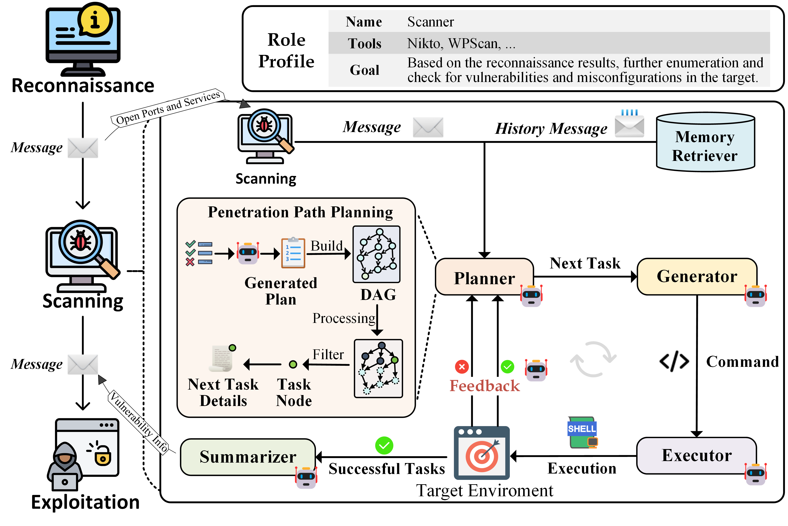

# VulnBot: Autonomous Penetration Testing for a Multi-Agent Collaborative Framework

<p align="center">
  <a href=''></a> 
  <a href='https://arxiv.org/abs/2501.13411'>.svg'></a> 
</p>

## Table of Contents

- [Overview](#overview)
- [Quick Start](#quick-start)
- [Citation](#citation)
- [Contact](#contact)

---

## Overview

**Note:**
- ⭐ **If you find this project useful, please consider giving it a <font color='orange'>STAR</font>!** ⭐
- If you encounter any <font color='red'>errors</font> or <font color='red'>issues</font>, feel free to open an issue or submit a pull request.

VulnBot is an advanced automated penetration testing framework that utilizes Large Language Models (LLMs) to replicate the workflow of human penetration testing teams within a multi-agent system. This innovative approach enhances efficiency, collaboration, and adaptability in security assessments.



*This RAG implementation is based on [Langchain-Chatchat](https://github.com/chatchat-space/Langchain-Chatchat). Special thanks to the authors.*

---

## Quick Start

### Prerequisites

Ensure your environment meets the following requirements before proceeding:

- **Programming Language:** Python 3.11.11
- **Package Manager:** Pip

### Installation

Install VulnBot using one of the following methods:

#### Build from Source

1. Clone the VulnBot repository:

   ```sh
   git clone https://github.com/KHenryAegis/VulnBot
   ```

2. Navigate to the project directory:

   ```sh
   cd VulnBot
   ```

3. Install the dependencies:

   ```sh
   pip install -r requirements.txt
   ```

### Configuration Guide

Before initializing VulnBot, you need to configure system settings. Refer to the [Configuration Guide](Configuration%20Guide.md) for detailed instructions on modifying:

- **Kali Linux configuration** (hostname, port, username, password)
- **MySQL database settings** (host, port, user, password, database)
- **LLM settings** (base_url, llm_model_name, api_key)
- **Enabling RAG** (set `enable_rag` to `true` and configure `milvus` and `kb_name`)

### Initialize the Project

Before using VulnBot, initialize the project:

```sh
python cli.py init
```

### Start the RAG Module

```sh
python cli.py start -a
```

### Run VulnBot

To execute VulnBot, use:

```sh
python cli.py vulnbot -m {max_interactions}
```

Replace `{max_interactions}` with the desired number of interactions.

---

## Citation

If you use VulnBot for academic purposes, please cite our [paper](https://arxiv.org/abs/2501.13411):

```
@misc{kong2025vulnbotautonomouspenetrationtesting,
      title={VulnBot: Autonomous Penetration Testing for a Multi-Agent Collaborative Framework}, 
      author={He Kong and Die Hu and Jingguo Ge and Liangxiong Li and Tong Li and Bingzhen Wu},
      year={2025},
      eprint={2501.13411},
      archivePrefix={arXiv},
      primaryClass={cs.SE},
      url={https://arxiv.org/abs/2501.13411}, 
}
```

---

## Contact

If you have any questions or suggestions, please open an issue on GitHub. Contributions, discussions, and improvements are always welcome!

